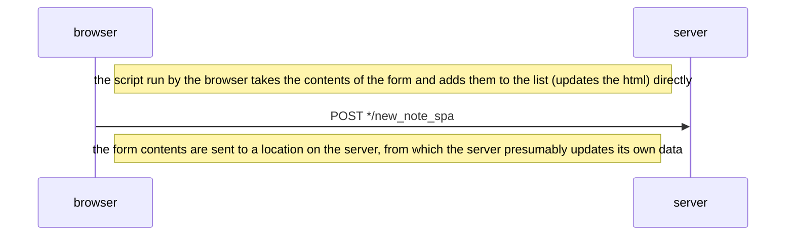

```mermaid

    sequenceDiagram

        participant browser
        participant server

        Note right of browser: the script run by the browser takes the contents of the form and adds them to the list (updates the html) directly
        browser->>server: POST */new_note_spa
        Note right of browser: the form contents are sent to a location on the server, from which the server presumably updates its own data


```